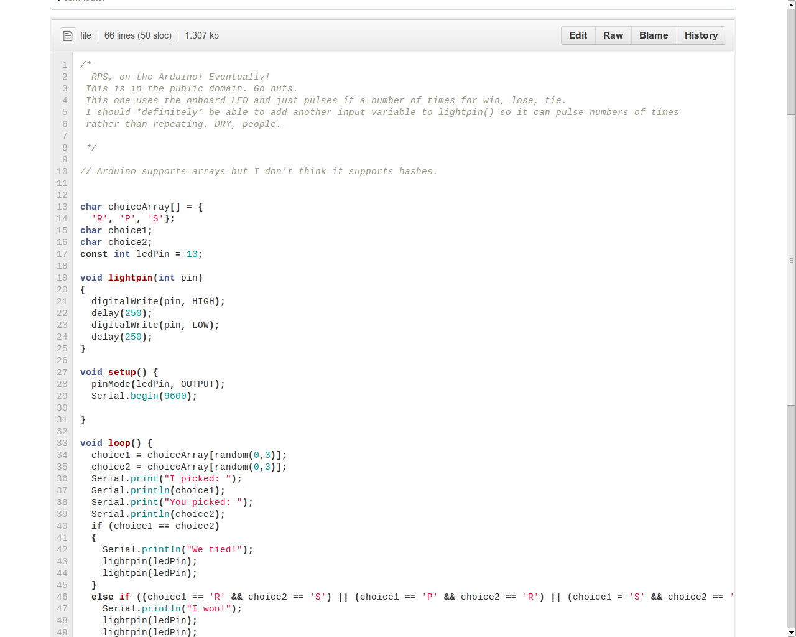

!SLIDE bullets incremental
# Arduino #
* From 2005
* Design projects 

!SLIDE full-size

!SLIDE bullets incremental
# Hardware #
* ATMega chips (328, mostly)
* USB (data and power)
* Lots of IO (digital/analog)

.notes Show board (if you haven't already). Talk about analog ins and PWMs and whatever else. Pass board around.

!SLIDE bullets incremental
# Software #

* Programmed with a simple IDE
* setup() and loop() mandatory
* other functions

!SLIDE full-size

!SLIDE bullets incremental
# Open Hardware #
* Chip is non-proprietary
* Schematics are open...
* ...so there are *lots* of clones
* *Name* is trademarked.

.notes This is intentional. Jillion billion clones, yet Arduino still in business, still makes money. Show your clone if you brought it. Note that Arduinos are around $25-$30 from digikey. 

