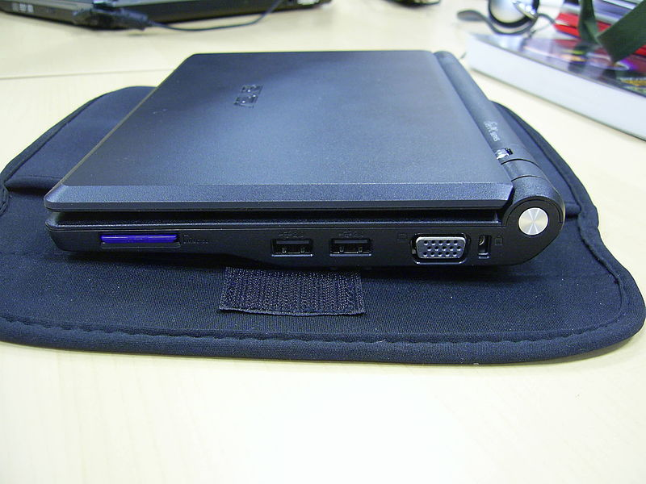

!SLIDE 
# The Future? #

!SLIDE bullets incremental
# Raspberry Pi clones? #

!SLIDE full-size

.notes eee 700. Who has one of these? EXPLOSION, then retraction, of formats after successful launch.

!SLIDE bullets incremental
# Arduino Due? #

.notes Arduino on steroids, on a 32bit ARM. Lots of Arduino-alikes that do this now, but an "official" Arduino could lead to huge developments in this space.

!SLIDE bullets incremental
# FPGAs? #

* Field Programmable Gate Array
* No idea.
